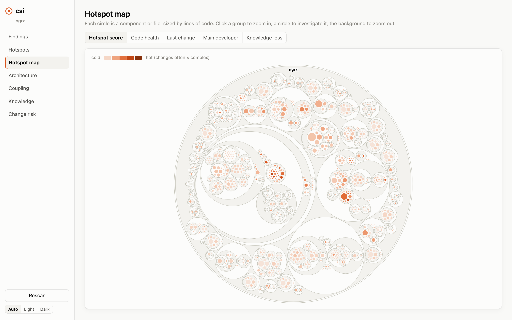
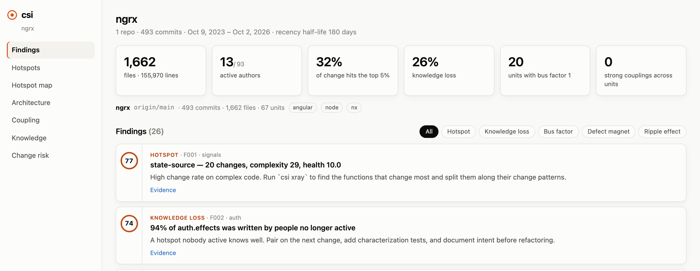
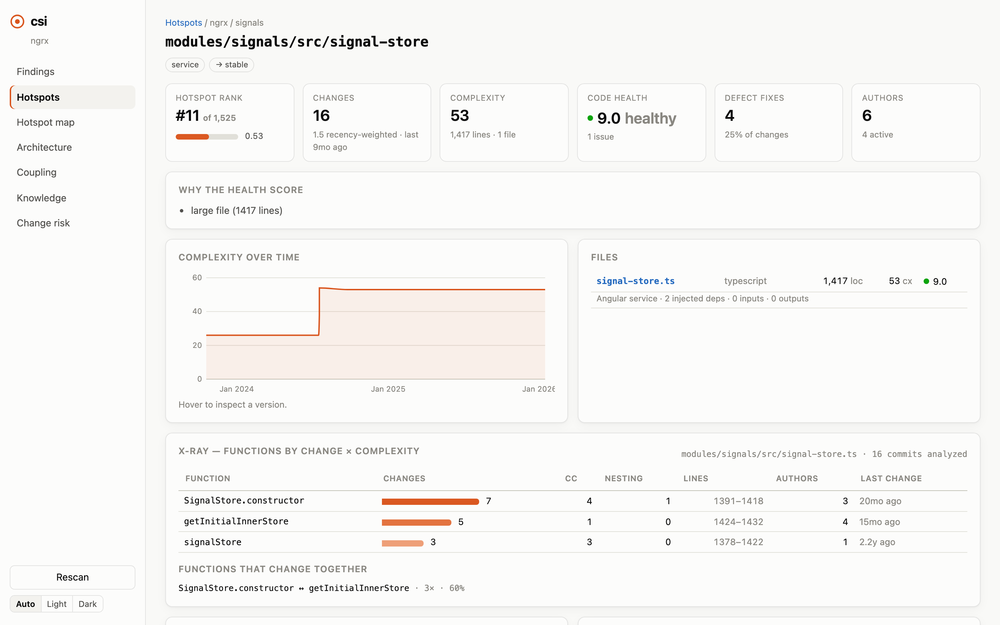
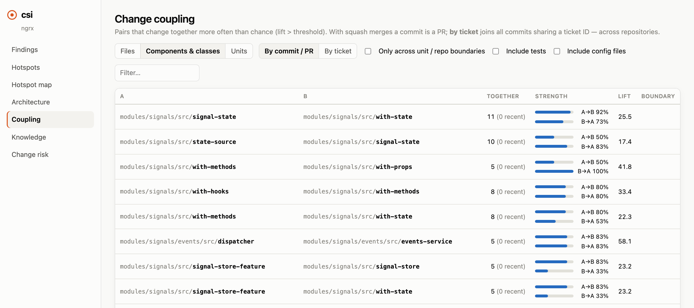

# csi: Crime Scene Investigator

[](https://github.com/Swoozeki/crime-scene/actions/workflows/ci.yml) [](LICENSE)

**Find your way around any codebase by reading its git history.**

csi shows you where the work happens, which files secretly depend on each other, and who to ask.
Use it on your first day at a new job, before a big change, or every time you open a PR.

It's one local binary. Your code never leaves your machine.

<picture>
  <source media="(prefers-color-scheme: dark)" srcset="docs/screenshots/map-dark.png">
  
</picture>

<sub>The hotspot map of [ngrx/platform](https://github.com/ngrx/platform). Each circle is a file or component, sized by
lines of code. The darker the circle, the more it changes and the more complex it is.</sub>

---

## Why history?

Code shows you what a system is today. History shows you how people actually work in it.
csi answers the questions you'd otherwise spend weeks asking around:

| Question | What csi looks at |
|---|---|
| **Where should I focus?** | *Hotspots*: complex code that changes often. In most codebases a few percent of files take most of the changes. |
| **What's connected that doesn't look connected?** | *Change coupling*: files that keep changing in the same commits, even with no import between them. |
| **Who do I ask?** | *Ownership*: who wrote each area, and whether they're still around. |
| **What's dangerous to touch?** | Code that keeps getting bug fixes, is getting more complex, or was written by people who've left. |

The ideas come from Adam Tornhill's book [*Your Code as a Crime Scene*](https://pragprog.com/titles/atcrime2/your-code-as-a-crime-scene-second-edition/).
csi is a fresh implementation that fixes the method's known weak spots (see [What makes it different](#what-makes-it-different)).

## Quick start

```bash
cd path/to/any/git/repo
csi report
```

That's it. No config. The first run reads the history (seconds for most repos, under a minute for
something the size of angular/angular). Later runs only read new commits.

```
Crime scene report — ngrx  1 repos · 493 commits · 1662 files · history since 2023-10-09

 77 F001  Hotspot: state-source — 20 changes, complexity 29, health 10.0
      signals · modules/signals/src/state-source
      High change rate on complex code. Run `csi xray` to find the functions that change most …

 68 F006  Hotspot: signal-store — 16 changes, complexity 53, health 9.0
      signals · modules/signals/src/signal-store
      Prioritize refactoring here: large file (1417 lines). Run `csi xray` on its main file …
```

Then open the interactive app:

```bash
csi serve --open
```

## Install

csi is built from source for now. You need [Rust](https://rustup.rs) (stable), plus
[Node.js](https://nodejs.org) 22.12+ (or 20.19+) and [pnpm](https://pnpm.io) to build the web app
that gets embedded in the binary. Check with `node -v`.

```bash
git clone https://github.com/Swoozeki/crime-scene.git
cd crime-scene
pnpm -C ui install && pnpm -C ui build
cargo install --path crates/csi-cli
```

This puts `csi` in `~/.cargo/bin`. csi also needs `git` on your PATH. It's tested on macOS and Linux.

## A tour

### Findings: what stands out

A ranked list of things worth knowing, each with its evidence and a suggested next step.



### Any file's record

Rank, health, complexity over time, and an **X-ray** of which functions inside the file take the
most changes. For a 1,400-line file, X-ray tells you which three functions to read first.



### Change coupling: hidden dependencies

Pairs of files that change together more often than chance. `signal-state` and `with-state` changed
together 11 times: there's a rule connecting them that no import statement will show you.



The app also has an architecture view (apps, libraries, micro-frontends and how they connect),
a knowledge map (who owns what, and which areas lost their authors), and a branch risk check.

## Using it to learn a new codebase

**Day one: build a mental map.**

```bash
csi hotspots --level unit     # the main parts, ranked by how much work goes into them
csi report                    # the most notable things
csi serve --open              # click around the map for 20 minutes
```

Write down the five busiest areas, who owns each, and any area nobody active knows.

**Before you touch a file:**

```bash
csi show src/app/cart/cart.component.ts   # rank, health, risky functions, experts
csi coupling src/app/cart                 # what usually changes with it
```

**Before you open a PR:**

```bash
git fetch && csi diff     # what usually changes with your files but isn't in this branch
```

### Good habits

- **Findings are questions, not verdicts.** "Defect magnet" means *ask why bugs land here*. Often there's a good reason.
- **Take the people results to people.** "You wrote most of the payment flow, can you give me 20 minutes?" is the most useful thing csi produces in your first month.
- **Trust coupling over imports.** Files that change together without importing each other share an unwritten rule.
- **Recent activity counts more.** Busy three years ago and quiet now usually means stable.
- **Never use it to judge people.** It measures where change happens, not how well anyone works.

## Use it with Claude Code (or any MCP agent)

csi includes an [MCP](https://modelcontextprotocol.io) server, so your coding agent can look at a
file's history before it explains or edits it.

```bash
cd path/to/repo
csi scan                          # run the first scan yourself so the server starts fast
claude mcp add csi -- csi mcp
```

Then ask things like *"Use csi to give me a tour of this codebase"* or
*"Before changing checkout pricing, use csi to tell me what's involved and what's risky."*

| Tool | What it returns |
|---|---|
| `file_context` | Everything about one file: rank, health, risky functions, what changes with it, experts |
| `findings` | The ranked report |
| `hotspots` | Hotspots for the workspace, a repo, an area or a path |
| `coupling` | What changes together with a file, including across repos |
| `xray` | Function-level hotspots inside a file |
| `experts` | Active people who know a file best |
| `review_diff` | Risk review of a branch or a ticket |

To have the agent use it without being asked, add a line like this to your `CLAUDE.md`:
*"Before explaining or editing code, call csi's `file_context` tool."*

## Use it in CI

```bash
csi diff origin/main...HEAD -f md > risk.md      # post as a PR comment
csi diff origin/main...HEAD --fail-above 80      # exit code 2 on very risky changes
```

CI needs full history (`fetch-depth: 0` on `actions/checkout`). Cache the `.csi/` folder between runs to keep it fast.

## Commands

| Command | What it answers |
|---|---|
| `csi report` | What stands out? Ranked findings with evidence and a next step |
| `csi hotspots` | Where does the work go? `--level file\|entity\|unit\|repo` |
| `csi show <file>` | Everything about one file |
| `csi xray <file>` | Which functions inside a file change most? |
| `csi coupling [path]` | What changes together? `--cross` for links between areas or repos |
| `csi owners [path]` | Who knows this code, and has anyone who wrote it left? |
| `csi trend <file>` | Complexity over time |
| `csi diff [base..head]` | How risky is this branch, and what did it miss? `--ticket ABC-123` spans repos |
| `csi serve --open` | The web app |
| `csi export --html report.html` | A single self-contained HTML file to share |
| `csi mcp` | MCP server for coding agents |
| `csi init <dir>` | Set up a multi-repo workspace |
| `csi scan` | Read new history now (other commands do this automatically) |

Every command takes `-f table|json|csv|md`. `--repo X` focuses on one repo in a workspace.

## Multiple repositories

If your system is spread over several repos (a shell app, micro-frontends, backend services):

```bash
csi init ~/work       # finds every repo under ~/work and writes ~/work/crimescene.toml
cd ~/work && csi report
```

csi links work across repos two ways:
- **Ticket IDs** in commit messages (`ABC-123` by default; set `[tickets] pattern`). With squash merges, put the ticket in the PR title.
- **Author sessions**: without tickets, one person's commits to different repos within 4 hours count as one change.

> **Note:** csi analyzes each repo's default branch (usually `origin/main`), not your current checkout.
> Run `git fetch` before scanning to see the latest work. csi never touches the network itself.

## What makes it different

Most of the work in behavioral code analysis is cleaning the data. csi does this before computing anything:

- **History follows renames**, and one person's different emails and names are merged (`.mailmap` and config aliases are supported).
- **Bots and AI co-authors are removed**: dependabot, renovate, Copilot and Claude co-author trailers.
- **Noise is filtered out**:
  - lock files, build output, vendored code, generated code, minified files, translations and changelogs
  - anything the repo marks `linguist-generated` or `linguist-vendored` in `.gitattributes`
- **Commits that say nothing about the design are neutralized**: formatting sweeps, releases, dependency bumps and framework upgrades. Huge commits are kept out of coupling.
- **Recent changes weigh more** (180-day half-life), so last month's fire outranks a refactor from 2021.
- **Real complexity** from parsing: per-function cyclomatic complexity and nesting for TypeScript, JavaScript, Angular templates, SCSS/CSS and PHP. Other languages use indentation-based complexity.
- **Components, not files.** `cart.component.{ts,html,scss,spec.ts}` is one component, so its own files don't drown out real coupling.
- **Architecture-aware.** Areas are detected from Angular workspaces, Nx projects, module federation, Node packages and Laravel/Symfony layout, or your own globs.
- **Statistically sound coupling.** Pairs need support, confidence and lift, not just a raw percentage. Pairs involving tests or config files are hidden unless you ask (`--tests`, `--config-files`).

<details>
<summary><b>How the scores work</b></summary>

- **Hotspot score** = change frequency (recency-weighted, log-scaled against the busiest code)
  × complexity percentile within its language × a language weight (TS/JS/PHP 1.0, templates 0.8,
  styles 0.5, config 0.3, docs 0.15). Test-only code counts half.
- **Code health** (1–10) starts at 10 and subtracts documented penalties: functions over complexity 15
  or 80 lines, nesting over 4, files over 600/1500 lines, more than 7 injected dependencies or 10 inputs,
  template complexity over 25, more than 20 methods in a PHP class. Each penalty is shown as a reason.
- **Coupling** keeps pairs with support ≥ 5, confidence ≥ 0.3 in at least one direction, and lift ≥ 1.5.
- **Defect magnets** are relative to the repo's own bug-fix rate (≥ 1.5×), so repos that label most commits `fix:` aren't flagged everywhere.

</details>

<details>
<summary><b>Configuration</b></summary>

Every key is optional. Inside a single repo csi needs no config at all. `csi init` writes a
`crimescene.toml` with the defaults:

| Key | Default | Meaning |
|---|---|---|
| `analysis.since` | `3 years` | How far back to read (`all` for everything) |
| `analysis.half_life_days` | 180 | How fast old changes lose weight |
| `analysis.max_commit_files` | 60 | Bigger commits are kept out of coupling and weighted 0.25 |
| `analysis.coupling_min_support` / `_confidence` / `_lift` | 5 / 0.3 / 1.5 | Coupling thresholds |
| `analysis.inactive_after_days` | 180 | When an author counts as gone |
| `analysis.top_n_xray` | 50 | Files that get function-level X-ray on each scan |
| `analysis.session_hours` | 4 | Cross-repo session window when there are no tickets (0 = off) |
| `exclude.globs` | | Extra paths to ignore, on top of the built-in list |
| `tickets.pattern` / `defects.pattern` | | Regexes over commit messages |
| `authors.bots` / `authors.aliases` | | Bot patterns; canonical name → aliases |
| `teams` | | Team → members, for coordination findings |
| `[[architecture.unit]]` | | Name / glob / kind, to define areas yourself |

</details>

## Development

```bash
pnpm -C ui install && pnpm -C ui build    # the web app, embedded into the binary
cargo test --workspace                    # unit + end-to-end tests on scripted git repos
cargo clippy --workspace --all-targets -- -D warnings
pnpm -C ui test:e2e                       # Playwright smoke tests (needs a release build)
```

The code is a Rust workspace (`crates/`) plus a Svelte web app (`ui/`). [SPEC.md](SPEC.md) has the
full design and the notes from tuning it on real repos.

## Credits

The method comes from Adam Tornhill's *Your Code as a Crime Scene* and his tool
[Code Maat](https://github.com/adamtornhill/code-maat). csi is written from scratch and shares no
code with Code Maat.

## License

[MIT](LICENSE)
